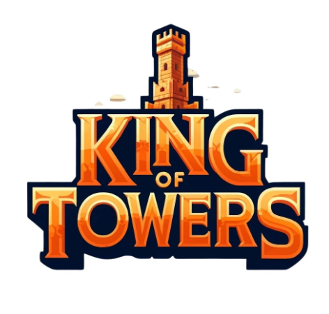
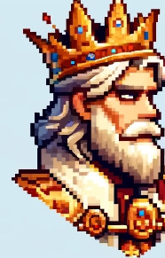
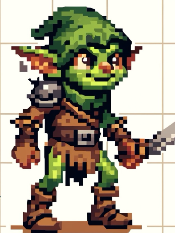
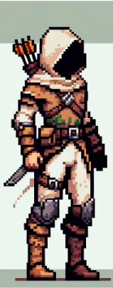
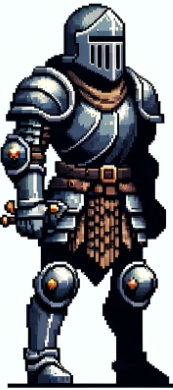
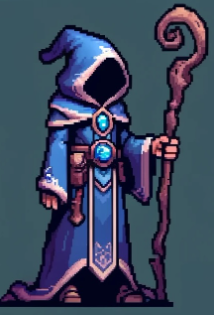
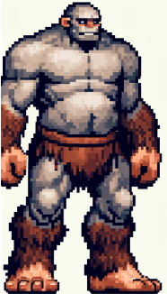
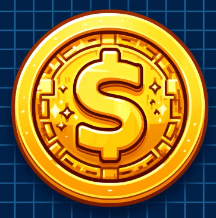

# King of Towers

"King of Towers" é um jogo MOBA(Multiplayer Online Battle Arena), ou em português, Arena de Batalha Multiplayer em Linha que narra a crônica de Eldoria, um reino despedaçado pelo poder e pela traição. Com a queda de um tirano sombrio, os reinos lutam pelo controle dos fragmentos de um artefato antigo, cada um desejando dominar os outros. À medida que a guerra ameaça consumir o mundo, uma nova sombra surge, forçando antigos inimigos a reconsiderar suas rivalidades. Em meio à magia e ao caos, os verdadeiros líderes de Eldoria temem cada vez mais e escolhem derramar sangue para obter o poder que podem e salvar seu próprio povo.

## Conceito do Jogo

O jogo King of Towers explora um universo onde cada jogador possui uma torre principal que produz Mobs (personagens não controláveis) que atacam as torres inimigas. Assim, todos os participantes estão atacando e recebendo ataques dos seus adversários. A mecânica principal do jogo consiste em posicionar torres de defesa e gerenciar melhorias entre as torres de defesa e ataque, para, com o passar do tempo, conseguir aumentar o poder de ataque e aumentar a resistência em relação ao poder do inimigo. Os upgrades são feitos a partir do pagamento em moedas de ouro, e as moedas são conquistadas a partir do abate dos Mobs que é feito automaticamente pelas torres de defesa. O campeão é aquele que conseguir derrotar as torres do inimigo e sobreviver até o fim.

## Mecânicas principais
O controle do jogo será através unicamente do mouse, com uma interface visual rica, os usuários poderão realizar as ações do jogo utilizando apenas os movimentos do mouse e o botão esquerdo para clicar/selecionar.

### Mecânicas do Player
O jogador terá uma visão de cima-baixo e poderá posicionar as torres em campos fixos sem uma ordem pré-estabelecida, trabalhando o posicionamento como uma decisão estratégica do jogo.
Jogador poderá escolher diferentes tipos de torre.
	
### Torre principal
A torre principal é responsável pela geração dos mobs, ela pode evoluir até o nível 5 e seus atributos melhoram a cada evolução. Os atributos são: Spawn (em mobs por segundo), nível do mob, regeneração, cooldown (da regeneração), vida útil total, custo.

### Torres de defesa
As torres de defesa possuem 3 tipos, cada tipo possui características que determinam a eficiência da defesa. As características são: DPS (dano por segundo), alcance e custo.

### Mobs
O nível dos mobs é definido pelo nível das torres. A cada nível, seus atributos vão melhorando, são eles: DPS (dano por segundo), vida útil, velocidade e valor. 

## Estilo Visual e Arte

### Personagens

| Nome      |     Sprite     | Tipo | Mecânicas | Upgrades |
|---------- |:-------------:| ------| ---- | ------|
| Rei   |   | NPC |  N/A | Upgrades associados ao upgrade da torre principal |

| Nome      |     Sprite     | Tipo | Mecânicas | Upgrades |
|---------- |:-------------:| ------| ---- | ------|
| Goblins   |   | NPC |  N/A | Mob de nível 1 |

| Nome      |     Sprite     | Tipo | Mecânicas | Upgrades |
|---------- |:-------------:| ------| ---- | ------|
| Arqueiros   |   | NPC |  N/A | Mob de nível 2 |

| Nome      |     Sprite     | Tipo | Mecânicas | Upgrades |
|---------- |:-------------:| ------| ---- | ------|
| Cavaleiros   |   | NPC |  N/A | Mob de nível 3 |

| Nome      |     Sprite     | Tipo | Mecânicas | Upgrades |
|---------- |:-------------:| ------| ---- | ------|
| Magos   |   | NPC |  N/A | Mob de nível 4 |

| Nome      |     Sprite     | Tipo | Mecânicas | Upgrades |
|---------- |:-------------:| ------| ---- | ------|
| Gigantes   |   | NPC |  N/A | Mob de nível 5 |

### Itens

| Nome      |     Sprite     | Benefícios | 
|---------- |:-------------:| ------| 
| Moeda   |   | Pode ser usada para fazer upgrades ou comprar torres de defesa |  

## Experiência do jogador

O jogo inicia com cada jogador portando 200 moedas, existem 4 slots de torres de defesa, sendo 2 à esquerda e 2 à direita da torre principal. O jogador deve definir uma estratégia de defesa. Enquanto isso, as torres principais estão gerando mobs, que seguirão um caminho definido no mapa. Ao eliminar mobs através do ataque das torres de defesa, o jogador coleta moedas, a quantidade de moedas coletadas por eliminação varia de acordo com o nível do mob. Com o passar do tempo o jogador deve administrar seu ataque e defesa, fazendo os upgrades necessários que condizem com sua estratégia e seu estado no jogo. Por exemplo, se o jogador estiver recebendo muitos ataques, e o inimigo estiver gerando mais mobs do que as torres de defesa conseguem eliminar, ele deve evoluir suas torres, reposicioná-las ou substituí-las. Em outro caso, se o jogador estiver muito bem defendido, mas não conseguir atacar o oponente, deve investir suas moedas na geração de mobs, evoluindo sua torre principal. Com isso, o jogador pode utilizar dos mecanismos do jogo para se beneficiar, ele pode, por exemplo, melhorar sua defesa para dar um alívio à torre principal, que, após o cooldown, começará a se recuperar. Ele também tem a opção de vender uma torre (por um preço 20% menor que o seu custo total), para investir mais na torre principal e fazer um contra-ataque. Por fim, quando o jogador consegue destruir a torre principal do inimigo, ele vence o jogo.

## Plataformas e Tecnologia
O jogo, inicialmente, será lançado apenas para Web, sem pretensão de explorar outras plataformas no futuro.

